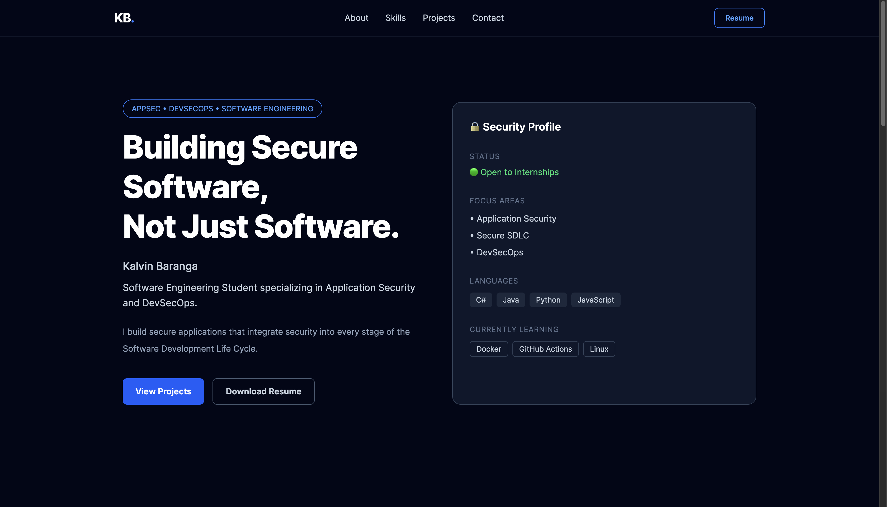

<p align="center">
  
</p>

<div align="center">

# Secure Portfolio

### *Application Security • DevSecOps • Software Engineering*

<p align="center">
  <a href="https://theebaranga.github.io/secure-portfolio/">
    
  </a>

  

  

  

  
</p>

A modern, responsive portfolio showcasing my projects, technical skills, and passion for building **secure**, **high-quality software**.

</div>

---

## Overview

This portfolio was built to demonstrate both my software engineering skills and my focus on modern Application Security and DevSecOps practices.

Beyond showcasing projects, the goal was to build a polished experience with smooth animations, responsive layouts, accessibility, and clean component architecture.

---

## Features

- Modern dark UI
- Fully responsive design
- Smooth scroll animations
- Premium mobile navigation drawer
- Background blur overlay
- Interactive project cards
- Featured projects section
- Technical skills showcase
- Downloadable résumé
- Contact section
- Accessible, semantic markup

---

## Tech Stack

| Category | Technologies |
|----------|--------------|
| Frontend | React, Vite |
| Styling | Tailwind CSS |
| Icons | React Icons |
| Deployment | GitHub Pages *(Vercel coming soon)* |
| Version Control | Git & GitHub |

---

## Project Structure

```text
src/
│
├── assets/
├── components/
│   ├── layout/
│   ├── sections/
│   └── ui/
│
├── data/
├── hooks/
├── App.jsx
└── main.jsx
```

---

## Getting Started

### Clone the repository

```bash
git clone https://github.com/TheeBaranga/secure-portfolio.git
```

### Navigate into the project

```bash
cd secure-portfolio
```

### Install dependencies

```bash
npm install
```

### Run the development server

```bash
npm run dev
```

### Build for production

```bash
npm run build
```

### Preview production build

```bash
npm run preview
```

---

## Live Demo

**GitHub Pages**

> https://theebaranga.github.io/secure-portfolio/

*(Deployment currently hosted on GitHub Pages. Vercel deployment coming soon.)*

---

## What I Learned

Building this project strengthened my understanding of:

- Responsive UI design
- Component-based architecture
- Modern React development
- Tailwind CSS best practices
- Animation and micro-interactions
- Git workflow and deployment
- Performance optimization
- Accessibility principles

---

## Future Improvements

- [ ] Deploy on Vercel
- [ ] Blog section
- [ ] Dark/Light theme toggle
- [ ] Project filtering
- [ ] Command palette
- [ ] More case studies
- [ ] Performance analytics

---

## About Me

I'm passionate about building secure, scalable software and continuously improving my skills in Software Engineering, Application Security, and DevSecOps.

I'm always looking for opportunities to collaborate, learn, and contribute to impactful projects.

---

## Connect With Me

- GitHub: **https://github.com/TheeBaranga**
- LinkedIn: **https://www.linkedin.com/in/kalvinbaranga**

---

## ⭐ Support

If you like this project, consider giving it a ⭐ on GitHub.

It helps others discover the project and motivates me to keep improving it.

---

<div align="center">

Built by **Kalvin Baranga**

</div>